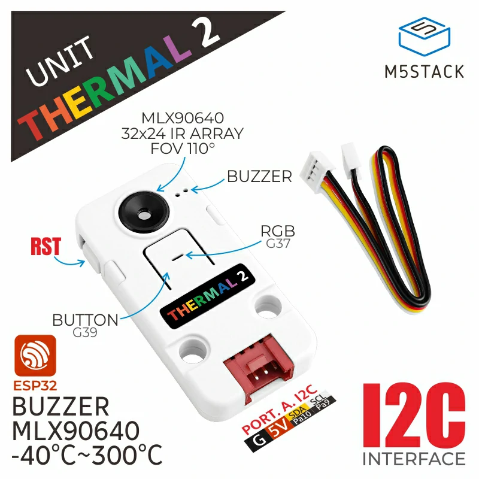

# M5Unit-Thermal2-Internal-FW

## Documents

[Link](https://docs.m5stack.com/en/unit/UNIT%20Thermal2)

## I2C Protocol

[Link](./docs/M5UnitThermal2-I2C-Protocol.pdf)

## Library

[Link](https://github.com/m5stack/M5Unit-Thermal2)
